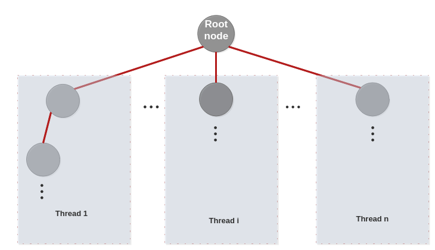

# Parallel Chess Engine: Educational Parallel Search, Visualization, and Analysis

---

## Project Overview

This project demonstrates the power and challenges of parallel programming in chess engine search algorithms. It features:
- A C engine implementing both sequential and parallel (OpenMP root splitting) alpha-beta search.
- A modern Streamlit UI for interactive analysis, visualization, and educational exploration.
- Robust support for custom FEN input, move legality, and detailed search statistics.
- Python scripts and a Jupyter notebook for further experimentation and visualization.

---

## Educational Context

Chess programming is a classic AI and computer science challenge. The minimax algorithm with alpha-beta pruning is the foundation of most chess engines. However, parallelizing this search is non-trivial due to the dependencies in pruning. This project explores and visualizes the impact of parallelization using root splitting, a simple and effective technique.

---

## Key Features

- **C Engine**: Implements both sequential and parallel alpha-beta search using OpenMP. Includes a rich, educational evaluation function with classic chess heuristics.
- **Streamlit UI**: Visualizes the search tree, principal variation, move annotations, and performance metrics. Allows custom FEN input and interactive exploration.
- **Robustness**: Handles illegal moves, edge cases, and provides clear error messages in both terminal and UI.
- **Visualization**: Includes a plotting script and notebook for performance analysis and experimentation.

---

## Directory Structure

- `src/seq_vs_paral.c` — Main C engine (sequential & parallel search)
- `ui.py` — Streamlit dashboard for interactive analysis
- `plot_results.py` — Python script for plotting engine results
- `parallel_chess_engine.ipynb` — Jupyter notebook for educational experiments
- `images/` — Diagrams and UI screenshots
- `Makefile` — Build instructions
- `.gitignore` — Excludes build artifacts, results, and temp files
- `README.md` — This guide

---

## How It Works: Engine & Parallelization

### Sequential Search
- Uses minimax with alpha-beta pruning to search the game tree.
- Evaluates each position using a rich evaluation function (material, mobility, king safety, pawn structure, etc.).

### Parallel Search (Root Splitting)
- At the root, each legal move is assigned to a separate thread using OpenMP.
- Each thread searches its subtree independently.
- Results are combined in a critical section to select the best move.
- This approach is simple, effective, and demonstrates real-world speedup.



---

## Streamlit UI: Features & Flow

- **Engine Control**: Run the C engine from the UI, select search depth, and upload previous results.
- **Custom FEN Input**: Enter any legal FEN to analyze arbitrary positions. Robust validation and feedback.
- **Results Summary**: View node counts, timing, and speedup for sequential vs. parallel search.
- **Chessboard Visualization**: Step through root moves and see the board update, with move highlighting.
- **Best Continuation Tree**: Interactive tree diagram of the best line, with per-node stats and click-to-explore.
- **Move List & Annotations**: See the principal variation with evaluation scores and chess motifs (check, capture, fork, etc.).
- **PGN Export**: Download the best line as a PGN for use in chess GUIs.
- **Error Handling**: Clear messages for illegal FENs, no legal moves, or engine errors.

---

## Step-by-Step Workflow

### 1. Build the Engine
```bash
make
```

### 2. (Optional) Set a Custom FEN
- Edit `fen.txt` or use the Streamlit sidebar to input a FEN.

### 3. Run the Engine
```bash
./chess 3
```
- Replace `3` with your desired search depth.
- Output is printed to the terminal and saved to `results.txt`.

### 4. Launch the Streamlit UI
```bash
streamlit run ui.py
```
- Open your browser to `http://localhost:8501`.
- Use the UI to analyze, visualize, and export results.

### 5. (Optional) Plot Results in Python
```bash
python3 plot_results.py
```
- Shows bar charts for execution time and nodes visited.

### 6. (Optional) Explore the Notebook
- Open `parallel_chess_engine.ipynb` for a step-by-step educational walkthrough and experiments.

---

## Output & Interpretation

- **results.txt**: Contains node counts, timing, principal variation, and legality checks.
- **UI Visuals**: See best move sequence, search tree, move annotations, and performance metrics.
- **Plotting**: Bar charts for time and nodes, speedup calculation.

---

## Troubleshooting & FAQ

- **Engine crashes or segfaults?**
  - All move generation now has bounds checks. If you still see issues, check your FEN or report the bug.
- **No legal moves found?**
  - The FEN may be illegal or a checkmate/stalemate position.
- **UI shows errors?**
  - Check `results.txt` for error messages. The UI will guide you to fix FEN or rerun the engine.
- **How do I add new evaluation features?**
  - Edit `estim` in `src/seq_vs_paral.c` and recompile.
- **How do I export a line to PGN?**
  - Use the "Export Principal Variation as PGN" button in the UI.

---

## For Presentations: How to Explain This Project

- **Goal**: Show how parallel programming (OpenMP) can speed up chess engine search, and make the process educational and interactive.
- **C Engine**: Implements both classic and parallel alpha-beta search, with a focus on clarity and educational value.
- **UI**: Makes the engine accessible, visual, and interactive for all users.
- **Evaluation**: Rich heuristics, not just material—teaches chess and programming concepts.
- **Robustness**: Handles errors, illegal moves, and edge cases gracefully.
- **Visualization**: Bridges the gap between code and chess understanding.

